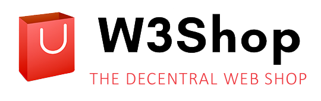

# W3Shop.eth

<p align="center">
  
</p>


This is a user-friendly, decentralized webshop that can be self operated, self hosted and is powered only by Blockchain technology.

> Access the Dapp under [https://w3shop.eth.limo](https://w3shop.eth.limo) or
> [https://w3shop.eth](https://w3shop.eth) (for IPFS enabled browsers)

## Features

1. **No payment processor required.** No setup of Paypal or Stripe accounts or even bank accounts to sell or buy digital
   goods.
2. **No comission fees.**. The smart contracts operate on their own and beside gas fees (which are reduced by using
   Layer 2 technology) **all** the proceedings go to the content creator.
3. **Fully hosted via chain based infrastructure.** You don't require an own server. All the static information
   that forms the heart of your shop is saved via blockchain infrastructure. You pay for it, but you own it.
4. **You own your shop.**. You fully decide what happens to your shop. You can modify, close or even
   sell it to someone else. Similiar to a real, physical shop.
5. **Immutable Contracts and permanent storage.** Those systems guarantee the accessibility of data for buyers over a
   long period of time.
6. **Royalty EIP-2981 support**: Digital goods sold via the shop, can signal a royalty fee so the creator can earn
   on secondary market sells.
7. **Limited Items:** Sell limited editions of your digital items.

> **WARNING:** This project is in an ALPHA stage. The contracts are neither audited nor well tested. Please consider
> everything as experimental.

> **DISCLAIMER:** Only sell items which you are legally allowed to! Clearify with your jurisdiction on what information you
> need to provide in order to operate an online shop.

## How does it work?

- The digital goods and shop data is stored encrypted on [Arweave](https://www.arweave.org/) via the
  [Bundlr Network](https://bundlr.network/), referenced by a smart contract that can be accessed from the URL.
- Buyers purchase a NFT, representing their access right to this digital content. They can download it and when they
  rightfully own the NFT the [Lit Protocoll](https://litprotocol.com/) is used to decrypt the digital content.

## Upcoming Features

These feature are loosly planned without a fixed time table. Its not sure if they work out but they are researched
and part of the vision:

- **Automatic Currency Conversion:** Pay in any currencies and the receiving smart contract does an automatic conversion
  to the currency the shop owner wants to receive.
- **Community Curated Shop Directory:** Imagine a curated list of shops that is indexed and searchable in a
  decentralized environment.
- **Access Restriction:** Use a shop only if you have a special membership NFT.
- **Shop Federation:** Kickstart new shops that own no digital currency by financing the setup costs via a collective.

Discuss with us in our [W3Shop Orbis Club Group](https://orbis.club/group/kjzl6cwe1jw148g91hce2elv8hiktmbs2bppox00qtenvu1k73jlqa7yxmle7e0)
about your favorite (or even new ideas).

## Usage

### Create a Shop

TODO Short description on how to use it.

### Sell Digital Content

TODO Short description on how to use it.

### Buy Content

TODO Short description on how to use it.

## Current Risks

Not all components that are required to create this project fully decentralized yet.
Here is a list of which part of the code is currently critical and what are the associated risks with this technology.

| Component                           | Description                                                                                                                                                                                    | Mitigation                                                                                                                                            |
| ----------------------------------- | ---------------------------------------------------------------------------------------------------------------------------------------------------------------------------------------------- | ----------------------------------------------------------------------------------------------------------------------------------------------------- |
| ENS Gateway w3shop.eth.limo         | This is a DNS resolved IPFS gateway that could be taken down.                                                                                                                                  | You can use a IPFS enabled browser or an addon like [ipfs-compagnion](https://github.com/ipfs/ipfs-companion) to directly resolve w3shop.eth instead. |
| Lit Protocol for content decryption | The protocol is in alpha stage and its unclear if it will be there forever or a critical flaw will be found. For more information check their page [litprotocol.com](https://litprotocol.com/) | -                                                                                                                                                     |
| Arweave Gatways                     | Arweave uses gateways like `https://arweave.net/<CONTENT_ID>` in order to fetch the saved content. Uses DNS too.                                                                               | You can start your own Arweave Gateway. Soon there will be support in the Dapp to point Arweave URLs against a custom gateway.                        |
| Bundlr Network for content upload   | Could go offline and is currently centralized and in alpha phase. It currently also uses only two nodes that are reachable via DNS.                                                            | -                                                                                                                                                     |
| Arbitrum                            | Currently Arbitrum is in beta phase and still can be stopped via their team. Its also not fully decentralized yet so in theory manipulation is possible. Use with caution.                     | -                                                                                                                                                     |

## Development

This project requires two parts, one is the shop application that is found in `/website`, the other components are
the underyling smart contracts that are found inside `/contract`.

To do proper testing you will need some test Ether on Arbitrum Goerli. You can use the
[Rinkeby faucet](https://faucet.rinkeby.io/) (if it is not working you can also try the
[Chainlink Faucet](https://faucets.chain.link/arbitrum-rinkeby) or the [Paradigm Faucet](https://faucet.paradigm.xyz/))
and the [Arbitrum Rinkeby Bridge](https://bridge.arbitrum.io/) to transfer those ETH to the test Arbitrum (make sure
you switch your Metamaskn network to Arbitrum Goerli).

### Webpage

The shop software is written with Angular. In order to start local developing right away do the following after you checked
out the repository:

```shell
cd website
npm run start
```

This sets up a environment where all key components that interact with chain or external infrastructure are mocked away.
So you don't need any requirements other then an installed Metamask wallet in order to develop the page locally.

Navigate to `http://localhost:4200/`. The app will automatically reload if you change any of the source files.
In case you want to access an example shop you can to to `http://localhost:4200/a2p6bDZmZGR1YjloeGYycTMxMmE1cWp0OXJhM295emI3bHRoc3J0d2huZTB3dTU0aXV2ajg1MmJ3OXd4ZnZz`.

In order to run the unit tests (which at this point in time are very incomplete), run:

```shell
npm run test # Unit tests
npm run e2e # End 2 End tests
```

### Contracts

Here is a list of all the contracts deployed to the different networks. Please always check if you interact with the right
contracts.

| Contract                     | Network         | Address                                                                                                                                     |
| ---------------------------- | :-------------- | :------------------------------------------------------------------------------------------------------------------------------------------ |
| W3ShopFactory                | Arbitrum Goerli | [0x89A0027324d7F5e5837e80C238eA0A0C194FBe58](https://testnet.arbiscan.io/address/0x89A0027324d7F5e5837e80C238eA0A0C194FBe58) |
| W3PaymentProcessor (Default) | Arbitrum Goerli | [0xFd14A937D2889CF24fe84a3c0c9D6BEb285049fB](https://testnet.arbiscan.io/address/0xFd14A937D2889CF24fe84a3c0c9D6BEb285049fB) |
| W3ShopFactory                | Arbitrum One    | [0xf6A7028cc183b38e3c615B5Aa0731012DA09Bdd3](https://arbiscan.io/address/0xf6A7028cc183b38e3c615B5Aa0731012DA09Bdd3)                        |
| W3PaymentProcessor (Default) | Arbitrum One    | [0x7E3e552721143977F6c0580b4Cf45d8357C65C1d](https://arbiscan.io/address/0x7E3e552721143977F6c0580b4Cf45d8357C65C1d)                        |

## Contributing

> This project is created only in my spare time. Feel free to open PR for improvements you would like to see! Any help
> is welcomed here.

The goal of this project is to maximaze decentralness by not operating any owned infrastracture (like a Raspi Pi in the
living room). It should be seen as a demonstrator how to maximize userfriendliness and decentralization.
Keep this in mind when introducing new dependencies and think about if the service would still be operational, even if
this dependency goes down (e.g. some centralized APIs). Always prefer self-hostable or decentralized infrastructure over
central one (e.g. ENS over DNS).

### Missing Features

As a few ideas what is currently missing and might be a good starting point:

- Unit and E2E Tests for the website
- Item removal from current shop
- Limited edition items
- Improvement of shop creation (and general UX)
- I18N of the shop and the NFT Metadata
- Tradepost for decentral exchange of shop items
