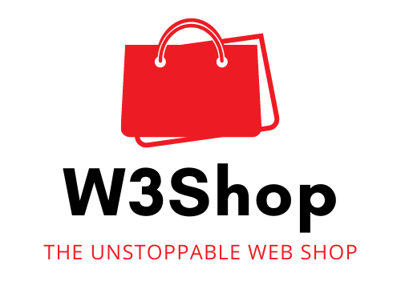

# W3Shop.eth

<p align="center">
  
</p>


A decentralized, unstoppable Webshop that can be self operated, self hosted and is powered by Blockchain technology.

## Philosophy

NFTs have far more use cases then just for funny Ape pictures. You can use them to control access to digital goods.
This webshop has a few principles that should help to make this vision come true:

1. Use cheap and secure infrastructure. This software is L2 first and will focus on implmentations directly on a rollup
   like Arbitrum.
2. It tries to use decentralized techs that dont require a centralized API like Infura to work. This is not yet 100%
   archivable but this direction should be taken whenever possible!
3. Ease of use - Setting up the shop must be possible for everyone, not only crypto professionals. As long as you can
   install a wallet usage of the shop should be possible.
4. Maximal trustlessnes, the shop should be operational without requiring you to host or manage hard- and software.
5. Immutable Contracts where possible

## How does it work?

- The webshop lives in IPFS and is reachable from [w3shop.eth](ipfs://w3shop.eth) or [w3shop.eth.link](https://w3shop.eth.link)
  (for non ENS and IPFS enabled browsers).
- The user data of the shop is saved via [Ceramic](https://ceramic.network/) and controlled by owning the "Shop-Key" NFT,
  that is minted when the shop is deployed.
- The digital goods for sale are stored encrypted on Arweave or IPFS.
- Buyers purchase a NFT, representing their access right to this digital content. They can download it and when they
  rightfully own the NFT the [Lit Protocoll](https://litprotocol.com/) is used to decrypt the digital content.

### Buying Content

If a Shop owner sets a price this will generate a Merkle-Tree out of the chosen currency and the tuples of collection
IDs, item IDs and the price of the item.

```text
// CurrencyToken is either the Token contract addr, or 0 if native ETH is used.
root = MerkleTree(H(CurrencyToken), [H(Tuble(CollID, ItemID, Price))])
```

When you place an order, the shop will generate you a Merkle Proof of the items you want to purchase, from the data taken from the Ceramic shop descrition document.

### Planned Features

- Automatic Currency Conversion: Pay in any currencies and the receiving smart contract does an automatic conversion to the currency the shop owner wants to receive.
- Community goverened shop listing: Imagine a curated list of shops that is indexed and searchable in a decentralized environment
- Access Resitriction: Access a shop only if you have a special membership NFT

## How to use it?

TODO Short description on how to use it.

## Development

TODO Describe the quirks of how to get it to run.

### Issues

There are a few issues that needs to be resolved:

- IPFS folder change their CID if later a file is added. That prevents us from NFT metadata generation. We could use IPNS but this would require a signing key to be stored e.g. in Ceramic as the must be shared when the shop owner changes. Alternatively we can add more info about NFT metadata URLs directly in the NFT, but this makes creating/editing the shop more expensive.

### Webpage

The shop software is written with Angular. Run `ng serve` for a dev server. Navigate to `http://localhost:4200/`. The app will automatically reload if you change any of the source files.

#### Testing

Run `ng test` to execute the unit tests via [Karma](https://karma-runner.github.io).

Run `ng e2e` to execute the end-to-end tests via a platform of your choice. To use this command, you need to first add a package that implements end-to-end testing capabilities.

### Contracts

This project demonstrates an advanced Hardhat use case, integrating other tools commonly used alongside Hardhat in the ecosystem.

The project comes with a sample contract, a test for that contract, a sample script that deploys that contract, and an example of a task implementation, which simply lists the available accounts. It also comes with a variety of other tools, preconfigured to work with the project code.

Try running some of the following tasks:

```shell
npx hardhat accounts
npx hardhat compile
npx hardhat clean
npx hardhat test
npx hardhat node
npx hardhat help
REPORT_GAS=true npx hardhat test
npx hardhat coverage
npx hardhat run scripts/deploy.ts
TS_NODE_FILES=true npx ts-node scripts/deploy.ts
npx eslint '**/*.{js,ts}'
npx eslint '**/*.{js,ts}' --fix
npx prettier '**/*.{json,sol,md}' --check
npx prettier '**/*.{json,sol,md}' --write
npx solhint 'contracts/**/*.sol'
npx solhint 'contracts/**/*.sol' --fix
```

### Etherscan verification

To try out Etherscan verification, you first need to deploy a contract to an Ethereum network that's supported by Etherscan, such as Ropsten.

In this project, copy the .env.example file to a file named .env, and then edit it to fill in the details. Enter your Etherscan API key, your Ropsten node URL (eg from Alchemy), and the private key of the account which will send the deployment transaction. With a valid .env file in place, first deploy your contract:

```shell
hardhat run --network ropsten scripts/sample-script.ts
```

Then, copy the deployment address and paste it in to replace `DEPLOYED_CONTRACT_ADDRESS` in this command:

```shell
npx hardhat verify --network ropsten DEPLOYED_CONTRACT_ADDRESS "Hello, Hardhat!"
```

## Contributers

### Contributing

TODO

Setup https://shields.io/

This project uses template inspiration from  [Shop Homepage v5.0.4](https://startbootstrap.com/template/shop-homepage). Licensed under [MIT](https://github.com/StartBootstrap/startbootstrap-shop-homepage/blob/master/LICENSE)

